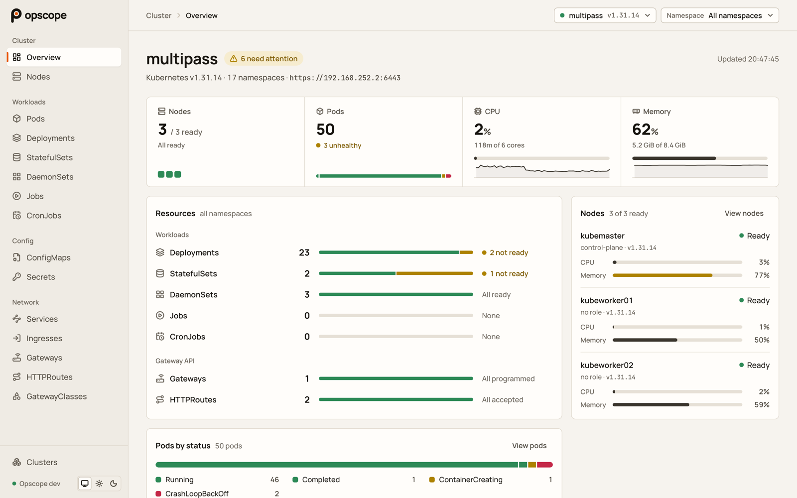
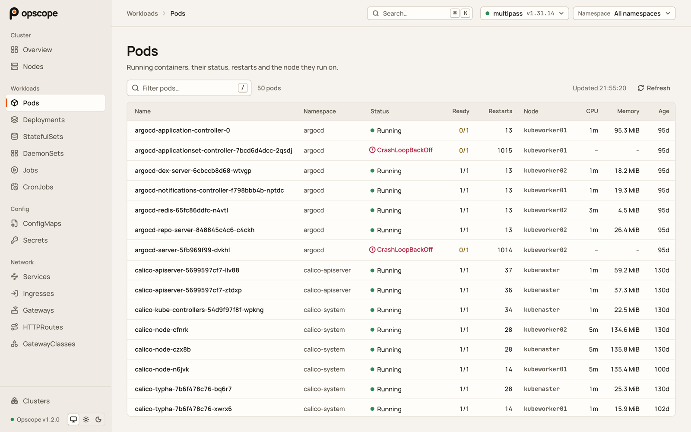
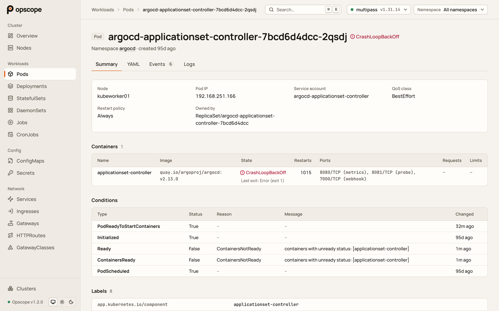

# Opscope

A small, read-only Kubernetes dashboard. Go backend, React frontend, one Docker image.

It shows nodes, workloads (Pods, Deployments, StatefulSets, DaemonSets, Jobs, CronJobs), config
(ConfigMaps, Secrets), networking (Services, Ingresses, and Gateway API Gateways, HTTPRoutes and
GatewayClasses), a cluster overview with what needs attention and recent warnings, a detail page
for every object (summary, YAML, events, pod logs), and live CPU and memory usage from
metrics-server. A ⌘K command palette finds any page or object by name, and keyboard shortcuts get
around without the mouse. It has light and dark themes, works on a phone, and never changes anything
in a cluster.

<picture>
  <source media="(prefers-color-scheme: dark)" srcset="docs/screenshots/overview-dark.png">
  
</picture>

| Pods | A pod's detail page |
| --- | --- |
| <picture><source media="(prefers-color-scheme: dark)" srcset="docs/screenshots/pods-dark.png"></picture> | <picture><source media="(prefers-color-scheme: dark)" srcset="docs/screenshots/pod-dark.png"></picture> |

The project was built in phases as a learning project; [docs/PHASES.md](docs/PHASES.md) has the
plan, what each phase delivered, and the decisions made along the way. The interface was then
redesigned in its own phases, recorded in [docs/UI-REDESIGN.md](docs/UI-REDESIGN.md), and the
command palette added in [docs/COMMAND-PALETTE.md](docs/COMMAND-PALETTE.md).

## Layout

```
backend/                  Go server
  main.go                 entry point: reads env vars, loads clusters, serves, shuts down cleanly
  internal/clusters/      known clusters (environment, in-cluster, added in the UI), clients for each
  internal/resources/     one file per resource type: lists it and flattens it into table rows;
                          detail.go builds detail pages, gatewayapi.go reads Gateway API resources
  internal/metrics/       live usage from metrics-server, and the in-memory history
  internal/server/        HTTP routes, middleware, static file serving
frontend/                 React app (Vite, plain JavaScript)
  src/api.js              fetch helper and the useApi hook
  src/clusters.jsx        shared list of clusters (React context)
  src/commands/           the command registry behind the palette and the shortcuts: matching,
                          the sources of global commands (sources/), keyboard shortcuts
  src/columns.jsx         table columns for each resource type
  src/format.js           ages, durations, sizes, kubectl style
  src/sections.js         list of pages (with their icons, short names and shortcuts); drives the
                          sidebar, the routes and the palette's "Go to" and object search
  src/theme.js            light, dark or follow the system; remembered in the browser
  src/toast.js            short confirmations at the bottom of the window ("Copied …")
  src/kubectl.js          read-only kubectl lines for one object, for copying
  src/styles/tokens.css   design tokens: colours for both themes, type, spacing, radius, motion
  src/styles/base.css     page-wide basics: fonts, links, focus ring, reduced motion
  src/components/         shared pieces, each with its own CSS file (buttons, tables, pickers,
                          dialogs, code blocks, logs, usage charts, the shell around every page)
  src/pages/              one file per page (plus its CSS where it needs some)
  src/kit/                the component kit at /kit (development only, left out of builds)
deploy/kubernetes/        manifests for running Opscope inside a cluster
data/                     local data (git- and docker-ignored): kubeconfigs, saved clusters
Dockerfile                builds the single image (for any platform; CI builds amd64 and arm64)
.github/workflows/        ci.yml: tests, build and image check for every pull request and push to main;
                          release.yml: publishes the image to GHCR for each version tag
.github/scripts/          check-manifest-tag.sh: the release's check that the manifest uses its image
.github/dependabot.yml    weekly updates for the (commit-pinned) GitHub Actions
Makefile                  common commands
docs/PHASES.md            build plan, progress and notes
docs/UI-REDESIGN.md       the interface redesign: design rules, phases and notes
docs/COMMAND-PALETTE.md   the command palette and shortcuts: design, phases and notes
docs/screenshots/         the pictures in this README
```

## Requirements

- Go 1.26+
- Node.js 24+
- Docker (for the image)
- metrics-server in the cluster, for usage numbers (optional)

## Connecting clusters

Opscope has no built-in cluster and never reads `~/.kube/config` on its own. There are three ways
to give it one:

1. **From a kubeconfig file.** Set `OPSCOPE_KUBECONFIG` to the file. That cluster is loaded at
   startup and marked "Environment" in the UI. Any kubeconfig works here, including ones that log
   in through a command (cloud CLI plugins).
2. **From inside the cluster.** Set `OPSCOPE_IN_CLUSTER=true` when Opscope runs as a pod. It then
   uses its pod's service account, and sees whatever that account's RBAC rules allow. See
   [Run in a Kubernetes cluster](#run-in-a-kubernetes-cluster).
3. **From the UI.** Open *Clusters → Add a cluster*, paste or upload a kubeconfig and pick a
   context. Opscope tests the connection and saves only that context to `DATA_DIR/clusters/`
   (files readable only by Opscope). For safety, kubeconfigs added this way must have their
   credentials embedded and can't run login commands. `kubectl config view --minify --flatten`
   prints a suitable copy of your current context.

## Command palette and shortcuts

Press ⌘K (Ctrl+K on Windows and Linux), or the search box in the top bar, and type:

- a page ("pods", or kubectl's short names: "po", "svc", "cm")
- an object's name, of any kind ("argocd-server"); start with a kind to search only that kind
  ("po api", "gtw main"). Objects in the selected namespace come first
- a namespace ("kube-system"), another cluster ("switch to"), or the theme
- what the current page can do: open a tab, copy the name, the YAML or a kubectl line (`get`,
  `describe`, `logs`; read-only commands only), follow logs, go to the owner or the node

Enter runs the highlighted command, ⌘/Ctrl+Enter opens a link in a new tab, and Escape clears the
box, then closes. Recently used commands come first when nothing is typed.

Without the palette:

| Keys                         | Does                                                  |
| ---------------------------- | ----------------------------------------------------- |
| `g` then `o` `n` `p` `d` `s` | Overview, Nodes, Pods, Deployments, Services          |
| `g` then `c`                 | Manage clusters                                       |
| `1` `2` `3` `4`              | An object's Summary, YAML, Events and Logs tabs       |
| `/`                          | The list's filter                                     |
| `?`                          | Every shortcut that works on the current page         |

Shortcuts are ignored while typing in a field.

### Adding commands

Every command comes from one registry (`frontend/src/commands/`), which feeds the palette, the
shortcuts and the `?` help. A command is a plain object (`id`, `title`, `group`, `icon`, and a link
`to`, an action `run` or a sub-list `items`, plus optional `shortcut` and search words); the shapes
are documented at the top of `commands/registry.jsx`.

| You add…                                            | You do…                                                        |
| --------------------------------------------------- | -------------------------------------------------------------- |
| a page in `sections.js`                             | nothing: "Go to" and its objects in search come with it; add `aliases` for short names and `shortcut` for a key |
| a resource to the backend's `Listers`               | nothing: it's in `/names`, so its objects can be found once it has a page |
| a command that works on any page                    | a file in `commands/sources/` and one line in `commands/index.js` |
| a command that belongs to one page or component     | `useCommands("id", [...commands], [deps])` in that component  |
| a key for any of these                              | `shortcut: "g x"` (or one key) on the command                  |

`ctx`, what every command can read and do (the cluster, the namespace, `navigate`, …), is built in
`commands/context.js`. Matching, ranking and the shortcut logic are plain functions with tests
(`npm test` in `frontend/`, or `make test` for everything).

## Security notes

- **Opscope has no login.** Anyone who can open the page can read everything Opscope can read, in
  every cluster it knows. Keep it on `127.0.0.1` (the Makefile does), reach it with
  `kubectl port-forward` when it runs in a cluster, or put something that adds authentication in
  front of it.
- **Secrets** are listed by key name only. A value is fetched only when you click "Reveal" on one
  key, and is sent with `Cache-Control: no-store`. Secret YAML has every value replaced with
  `(hidden, about N bytes)` and leaves out kubectl's `last-applied-configuration` annotation,
  which would otherwise contain the values.
- **Logs** are sent with `Cache-Control: no-store`, since they can contain sensitive data.

## Run in development

Two terminals:

```bash
make dev-backend
```

```bash
make dev-frontend
```

Open http://localhost:5173. Vite reloads the page when you edit frontend files and forwards
`/api/*` calls to the Go server on port 8080 (set `OPSCOPE_API`, for example
`OPSCOPE_API=http://localhost:8090`, to use another). Restart `make dev-backend` after Go changes.

http://localhost:5173/kit shows every design token and component in both themes, with sample data
and no cluster needed. It's the place to build or change a component before it's used on a page.

To start the backend with a cluster from a file:

```bash
make dev-backend OPSCOPE_KUBECONFIG=$PWD/data/multipass.kubeconfig
```

## Run with Docker

Each release is published to the GitHub Container Registry for amd64 and arm64:

```bash
docker run --rm -p 127.0.0.1:8080:8080 -v opscope-data:/data ghcr.io/unnikrishnannam/opscope:latest
```

Open http://localhost:8080 and add a cluster in the UI. Use a version tag (for example `:v1.1.0`)
instead of `:latest` to stay on one release.

To build the image yourself:

```bash
make docker-build
```

Then either start it empty and add clusters in the UI:

```bash
make docker-run
```

or with a cluster from a kubeconfig file (mounted read-only):

```bash
make docker-run-env KUBECONFIG_FILE=data/multipass.kubeconfig
```

Open http://localhost:8080. Saved clusters are kept in the `opscope-data` Docker volume.

The container must be able to reach the cluster's API server. A `server:` address of
`127.0.0.1` or `localhost` in the kubeconfig points at the container itself, not your machine.

### Using a kind cluster with Docker

kind clusters run in Docker and publish their API server on your machine's `127.0.0.1`, which a
container can't reach. Put Opscope on kind's Docker network instead, and use the kubeconfig kind
writes for that network (it uses the node's container name, which kind's certificate includes):

```bash
kind get kubeconfig --internal --name <cluster> > data/kind.internal.kubeconfig
```

Then either start Opscope with `--network kind` added to `docker run`, or connect a running one:

```bash
docker network connect kind <opscope-container>
```

When Opscope runs directly on your machine (`make dev-backend`), the normal kubeconfig works.

## Run in a Kubernetes cluster

The manifests in `deploy/kubernetes/` run Opscope as a pod that shows the cluster it runs in:

- `opscope.yaml`: a namespace, a service account, a read-only ClusterRole and its binding, the
  Deployment and a ClusterIP Service
- `secrets-access.yaml`: an optional second ClusterRole for Secrets (see below)

`opscope.yaml` uses the published image of the latest release (`ghcr.io/unnikrishnannam/opscope`,
amd64 and arm64), so the cluster pulls it by itself. To run your own build instead, set `image:` to
`opscope:dev` and, for kind, load it straight into the nodes:

```bash
make docker-build
```

```bash
kind load docker-image opscope:dev --name <cluster>
```

Apply the manifests and open Opscope through a port-forward:

```bash
kubectl apply -f deploy/kubernetes/
```

```bash
kubectl -n opscope port-forward svc/opscope 8080:80
```

Open http://localhost:8080. The cluster appears as "this cluster".

The pod runs as a non-root user with a read-only root filesystem, no Linux capabilities and the
default seccomp profile. It only writes to `/data` (an `emptyDir`, so clusters added in the UI
are lost when the pod is replaced; use a PersistentVolumeClaim to keep them). Liveness and
readiness probes use `/api/health`. On SIGTERM, Opscope stops taking new connections and gives
running requests up to 10 seconds to finish (open log streams are closed after that).

### Permissions

Opscope only ever uses `get` and `list`:

| API group                   | Resources                                               | Why                    |
| --------------------------- | ------------------------------------------------------- | ---------------------- |
| core (`""`)                 | namespaces, nodes, pods, services, configmaps, events   | lists and details      |
| core (`""`)                 | pods/log (`get`)                                        | the Logs tab           |
| `apps`                      | deployments, statefulsets, daemonsets                   | workloads              |
| `batch`                     | jobs, cronjobs                                          | workloads              |
| `networking.k8s.io`         | ingresses                                               | networking             |
| `gateway.networking.k8s.io` | gateways, httproutes, gatewayclasses                    | Gateway API (optional) |
| `metrics.k8s.io`            | nodes, pods                                             | CPU and memory usage   |
| core (`""`)                 | secrets (separate role, `secrets-access.yaml`)          | Secrets pages, Reveal  |

**Reading Secrets is a conscious choice.** With `secrets-access.yaml` applied, the Opscope pod can
read every Secret in the cluster, and so can anyone who can reach Opscope. To turn it off:

```bash
kubectl delete -f deploy/kubernetes/secrets-access.yaml
```

The Secrets pages then say "this user isn't allowed to read this", and everything else keeps working.

## Checks and releases

Every pull request and every push to `main` runs `.github/workflows/ci.yml`: `go vet`, a `gofmt`
check and the Go tests; the frontend's tests and build; and a Docker build for amd64 (not pushed).
`make test` runs the same tests locally.

Pushing a version tag publishes the image. `.github/workflows/release.yml` builds it for amd64 and
arm64 and pushes `ghcr.io/unnikrishnannam/opscope` with the tags `vX.Y.Z`, `X.Y` and `latest`
(a pre-release such as `v1.3.0-rc.1` gets only its own tag). Before anything is pushed, it runs the
tag's tests and checks that `deploy/kubernetes/opscope.yaml` uses the image being released; if
either fails, nothing is published. So a release takes three steps:

1. Change the image tag in `deploy/kubernetes/opscope.yaml` to the new version (for example
   `ghcr.io/unnikrishnannam/opscope:v1.2.0`), and merge that into `main`.
2. Tag the merged commit:

   ```bash
   git tag -a v1.2.0 -m "Release v1.2.0"
   ```

3. Push the tag:

   ```bash
   git push origin v1.2.0
   ```

Pre-releases skip the manifest check, so the manifest stays on the last real release. The
workflow can also be run by hand from the Actions tab for a tag that already exists; tags from
before the check (v1.0.0, v1.1.0) are published without it.

## Configuration

| Variable               | Default            | What it does                                                    |
| ---------------------- | ------------------ | --------------------------------------------------------------- |
| `PORT`                 | `8080`             | Port the server listens on                                      |
| `STATIC_DIR`           | `../frontend/dist` | Folder with the built React app (`/app/web` in the image)       |
| `DATA_DIR`             | `../data`          | Where clusters added in the UI are saved (`/data` in the image) |
| `OPSCOPE_KUBECONFIG`   | (none)             | Kubeconfig file for a cluster loaded at startup                 |
| `OPSCOPE_CONTEXT`      | current context    | Which context of that file to use                               |
| `OPSCOPE_IN_CLUSTER`   | (off)              | `true`: use the pod's service account (when running in a pod)   |
| `OPSCOPE_CLUSTER_NAME` | context name       | Display name for the environment or in-cluster cluster          |

## API

All endpoints are `GET` unless noted.

| Path                                                   | Returns                                                                         |
| ------------------------------------------------------ | ------------------------------------------------------------------------------- |
| `/api/health`                                          | `{"status":"ok","version":"..."}`                                               |
| `/api/clusters`                                        | All clusters (id, name, source, context, server)                                |
| `POST /api/clusters/inspect`                           | Contexts in a kubeconfig: `{"kubeconfig": "..."}`                               |
| `POST /api/clusters`                                   | Add a cluster: `{"name", "kubeconfig", "context"}`                              |
| `/api/clusters/{id}`                                   | Cluster plus `reachable`, `version`, or `error` and `detail`                    |
| `DELETE /api/clusters/{id}`                            | Remove a cluster added in the UI                                                |
| `/api/clusters/{id}/{resource}`                        | Rows for one resource type; `?namespace=` limits to one namespace               |
| `/api/clusters/{id}/overview`                          | Counts, node health and pods by status; `?namespace=` limits namespaced counts  |
| `/api/clusters/{id}/names`                             | Every object's kind, namespace and name (for search), and kinds `skipped`       |
| `/api/clusters/{id}/{resource}/{namespace}/{name}`     | One object: fields, containers, conditions, tables, events, YAML                |
| `/api/clusters/{id}/{resource}/{name}`                 | The same for cluster-wide kinds (nodes, namespaces, gatewayclasses)             |
| `/api/clusters/{id}/secrets/{namespace}/{name}/{key}`  | One secret value: `{"value", "base64"}`                                         |
| `/api/clusters/{id}/pods/{namespace}/{name}/logs`      | Plain-text logs; `?container=`, `?tail=` (default 500, max 10000), `?previous=true`, `?follow=true` streams |
| `/api/clusters/{id}/metrics/nodes`                     | Usage per node vs allocatable, cluster total, and 15 minutes of history         |
| `/api/clusters/{id}/metrics/pods`                      | Usage per pod (containers summed); `?namespace=`                                |

`{resource}` is one of `namespaces`, `nodes`, `events`, `pods`, `deployments`, `statefulsets`,
`daemonsets`, `jobs`, `cronjobs`, `configmaps`, `secrets`, `services`, `ingresses`, `gateways`,
`httproutes` or `gatewayclasses` (see `backend/internal/resources/resources.go`). Events are
returned newest first (at most 100) and accept `?type=Warning` or `?type=Normal`.

Errors look like `{"error": "readable message", "detail": "original error"}`. A cluster's "not
found" and "forbidden" keep their status (404, 403); other cluster failures are 502. Two optional
features answer `404` with a `code` instead of failing:

- `"code": "not_installed"`: the cluster has no Gateway API (`gateway.networking.k8s.io/v1`)
- `"code": "metrics_unavailable"`: the cluster has no working metrics-server

Opscope samples every cluster's usage every 15 seconds in the background and keeps the last
15 minutes in memory for the sparklines; that history starts empty after a restart.
